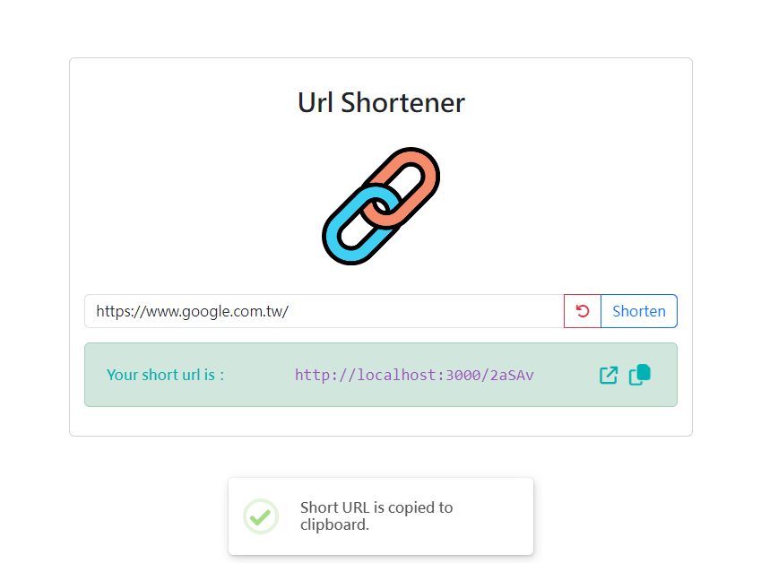

# Url Shortener

快速將長網址縮短的魔法！



輸入想要的網址即可一鍵縮短，詳細功能：
1. 縮短後可點擊按鈕另開新分頁導向原始網址
2. 縮短後可點擊按鈕複製縮網址
3. 輸入相同的網址會產生相同的縮網址


## Prerequisites

* Node.js
* Express @4.18.2
* Express-handlebars @4.0.2
* mongoose @7.0.4
* dotenv @16.0.3


## Installing

1. 安裝套件

```
npm install
```

2. 安裝 Nodemon 至全域 (若有安裝過可省略)
```
npm install -g nodemon
```

3. 啟動！(`ctrl+c` 可停止)
```
npm run dev
```

4. 可添加種子資料 (`ctrl+c` 可停止)
```
npm run seed
```


## Authors

* **Susan Lin** - *Initial work* - [Suz033](https://github.com/Suz033)
